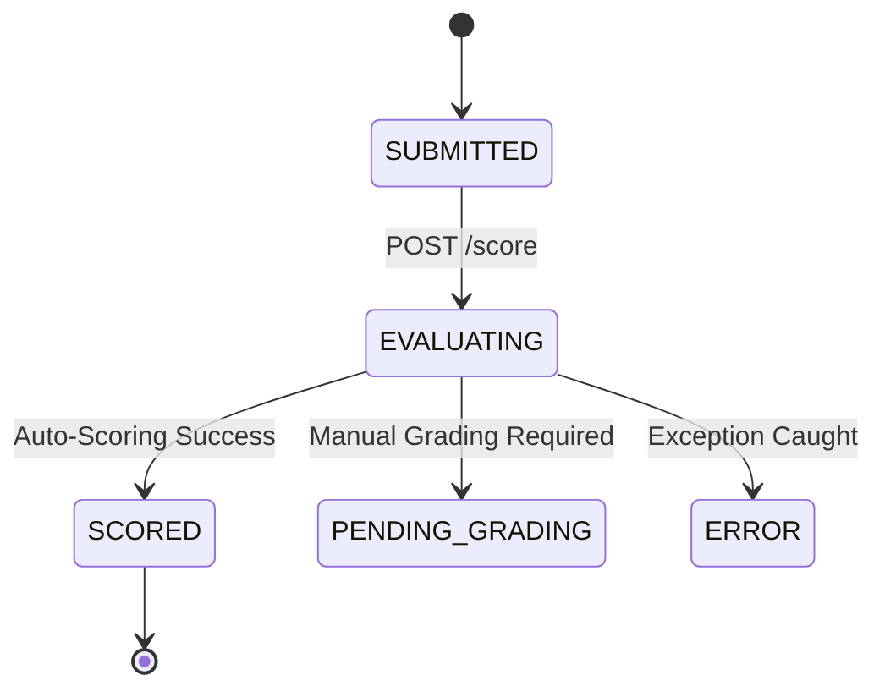

# 203 Scoring Engine Implementation Plan v1.0

**Document Version:** 1.0
**Phase:** Sprint 07 Phase 3
**Domain:** Assessment Scoring & Evaluation Engine
**Status:** DRAFT

## Executive Summary

The Scoring Engine represents the final, automated phase of the assessment lifecycle. Taking a `SUBMITTED` assessment attempt, this engine will parse candidate answers against the snapshot blueprint, evaluate correct/incorrect responses, apply partial credit and negative marking, calculate competency sub-scores, and generate an immutable result and audit trail.

This implementation plan details the architecture to build this engine without polluting the Execution Engine, maintaining strict separation of concerns through an asynchronous-ready design.

---

## 1. Architecture Overview

The Scoring Engine will follow a pipeline architecture orchestrated by a primary service.

### Pipeline Stages:
1. **Validation:** Ensure attempt is `SUBMITTED` and not already `SCORED` or `EVALUATING`.
2. **Extraction:** Retrieve `snapshot_json` blueprint and `candidate_answers`.
3. **Auto-Scoring Engine:** Iterate questions; calculate `raw_score` and `max_score` per question.
4. **Competency Engine:** Aggregate question scores into domain-specific `competency_scores`.
5. **Evaluation Engine:** Compare total score against thresholds to determine `PASS`/`FAIL`.
6. **Audit Engine:** Construct the detailed `result_audits` records.
7. **Finalization:** Persist all records atomically and transition attempt status to `SCORED`.

---

## 2. Database Findings (Review Area 1)

A review of the `database/migrations` directory reveals that a robust, forward-looking schema already exists for scoring:

- `assessment_results` (Top-level attempt score, percentage, pass/fail)
- `question_scores` (Individual question evaluations and awarded points)
- `section_scores` (Aggregated section performance)
- `competency_scores` (Domain-specific performance aggregates)
- `result_audits` (Line-item scoring ledger)
- `result_snapshots` (Immutable capture of the result at generation time)

### Migration Requirements:
**Minimal.** The existing tables fully support the Rulebook. Minor schema checks may be needed if we require `strategy_applied` or `penalty_applied` to be persisted directly rather than in an audit JSON blob.

---

## 3. Service Design (Review Areas 2, 3, 4, 5, 6)

### 3.1 `AutoScoringService`
- **Responsibility:** Scores individual questions based on the blueprint.
- **Input:** `candidate_answer` payload, `snapshot_question` definition.
- **Single Choice:** Applies strict equality.
- **Multiple Choice:** Applies set equality (for `ALL_OR_NOTHING`) or proportional math (for `PROPORTIONAL`). Applies `negative_marking` floor bounds.
- **Output:** Array of `QuestionScoreDto`.

### 3.2 `CompetencyScoringService`
- **Responsibility:** Aggregates question scores into domains.
- **Input:** Array of `QuestionScoreDto`, blueprint competency mappings.
- **Output:** Array of `CompetencyScoreDto`.

### 3.3 `EvaluationService`
- **Responsibility:** Determines final `PASS` or `FAIL`.
- **Input:** Total `rawScore`, `maxPossibleScore`, blueprint thresholds.
- **Output:** `PassFailResultDto`.

### 3.4 `AuditGenerationService`
- **Responsibility:** Creates the reproducible ledger.
- **Input:** Output from the Auto-Scoring Engine.
- **Output:** `ScoringAuditDto[]` mapped to `result_audits`.

### 3.5 `ScoringOrchestratorService`
- **Responsibility:** The Facade that wraps the transaction. Changes state to `EVALUATING`, invokes services 3.1 through 3.4, persists models, and changes state to `SCORED`.

---

## 4. API Orchestration (Review Area 7)

| Endpoint | Controller | Backed By |
|---|---|---|
| `POST /attempts/{uuid}/score` | `TriggerScoringController` | `ScoringOrchestratorService` |
| `POST /attempts/{uuid}/recalculate` | `RecalculateScoreController` | `ScoringOrchestratorService` (with override) |
| `GET /attempts/{uuid}/result` | `RetrieveResultController` | `AssessmentResult` Model → `AttemptResultResource` |
| `GET /attempts/{uuid}/competencies`| `RetrieveCompetenciesController` | `CompetencyScore` Model → `CompetencyResource` |
| `GET /attempts/{uuid}/audit` | `RetrieveAuditController` | `ResultAudit` Model → `AuditResource` |

---

## 5. DTO Design

- `QuestionScoreDto`: `questionUuid`, `maxScore`, `awardedScore`, `penalty`, `isCorrect`.
- `CompetencyScoreDto`: `competencyUuid`, `score`, `maxScore`, `percentage`, `passed`.
- `AttemptResultDto`: `attemptUuid`, `rawScore`, `percentage`, `passFailStatus`, `scoredAt`.
- `ScoringAuditDto`: `questionUuid`, `candidateAnswer`, `correctAnswer`, `strategyApplied`, `explanation`.

---

## 6. State Model Transitions

---

## 7. Testing Strategy (Review Area 8)

### Unit Tests (Service Layer)
- `AutoScoringServiceTest`: Validate binary match, array mismatch, partial credit math, and negative mark flooring.
- `CompetencyScoringServiceTest`: Validate cross-question score aggregation.
- `EvaluationServiceTest`: Validate absolute vs percentage threshold logic.

### Feature Tests (API Layer)
- `ScoringTriggerFeatureTest`: Validate `SUBMITTED` requirement, 409 on `EVALUATING`, success transaction.
- `ResultRetrievalFeatureTest`: Validate unauthorized access blocks, candidate retrieval success.

### Integration Tests
- `EndToEndScoringTest`: Simulate a full launch → auto-save → submit → score pipeline.

---

## 8. Implementation Sequence

| Phase | Target | Artifacts |
|---|---|---|
| Phase 4 | Auto-Scoring Engine | `AutoScoringService`, Tests |
| Phase 5 | Competency Engine | `CompetencyScoringService`, Tests |
| Phase 6 | Evaluation Engine | `EvaluationService`, Tests |
| Phase 7 | Audit & Persistence | Models, Factories, `AuditGenerationService` |
| Phase 8 | Orchestration & API | Controllers, Routes, Resources |
| Phase 9 | Integration Testing | End-to-End Tests |

---

## 9. Risk Register

| Risk | Impact | Mitigation |
|---|---|---|
| Heavy JSON parsing of snapshot per question. | Medium (Perf) | Parse `snapshot_json` once in Orchestrator and pass typed array to sub-services. |
| Floating point arithmetic drift in percentages. | Low | Use standard `bcmath` or rounding to 2 decimal places uniformly. |
| Duplicate scoring triggers. | High (Corruption)| Use `SELECT ... FOR UPDATE` lock on attempt when transitioning to `EVALUATING`. |

---

## Final Verdict

The architecture separates concerns cleanly, heavily leverages the existing un-utilized schema, and maintains the immutability boundaries.

**Status:** READY FOR READINESS REVIEW
