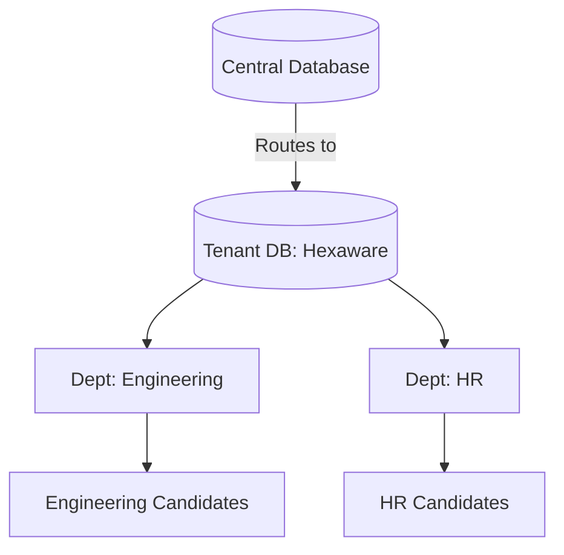

```mermaid
graph TD
    S[(Central Database)] -->|Routes to| V[(Tenant DB: Virtusa)]
    
    V --> BU1[Business Unit: Client A]
    V --> BU2[Business Unit: Client B]
    V --> BU3[Business Unit: Client C]
    
    BU1 --> C1[Client A Candidates]
    BU2 --> C2[Client B Candidates]
    
    style BU1 fill:#1e293b,stroke:#38bdf8
    style BU2 fill:#1e293b,stroke:#38bdf8
    style BU3 fill:#1e293b,stroke:#38bdf8
```

# SnapFlect Business Model & Tenancy Architecture

This document outlines how the SnapFlect Assessment Portal's hierarchical data structure and Role-Based Access Control (RBAC) natively support both Direct-to-Enterprise (B2B) and Partner/Reseller (B2B2B) business models.

## 1. Core Architectural Concepts

SnapFlect is built on a **Database-per-Tenant SaaS Architecture**. This provides the highest level of security, data isolation, and enterprise compliance (e.g., GDPR, SOC2).

To support complex corporate structures and agency relationships, the tenancy model utilizes two distinct database layers:

### A. The Central Database
Managed by Super Admins, this database stores global routing and identity data.
- **Organizations**: The root records for billing and routing (e.g., a direct client or a partner agency).
- **Domains**: The custom subdomains mapped to each Organization.
- **Global Users**: For Single Sign-On (SSO) routing to the correct tenant database.
- **Subscriptions**: Billing data (consolidated at the Organization level).

### B. The Tenant Databases (`snapflect_tenant_{id}`)
Each Organization gets its own physically isolated database containing:
- **Business Units**: High-level segments within an organization. *Crucial for the Partner Model to represent their downstream clients without spinning up infinite databases.*
- **Departments / Locations**: Granular organizational segments.
- **Roles & Permissions**: Fine-grained access control bound to specific scopes.
- **Assessments & Candidate Data**: Highly sensitive PII and test results.

---

## 2. The Direct Client Model (Example: Hexaware)

In this model, an enterprise purchases SnapFlect to assess their own internal employees or direct hires.

### How it works:
1. **Automated Provisioning**: The Tenant Orchestrator creates a new Organization record in the Central DB, dynamically creates a new `snapflect_tenant_hexaware` database, and migrates the schema.
2. **Strict Data Isolation**: Hexaware's data is physically walled off in its own database.
3. **Internal Hierarchy**: Hexaware administrators can mirror their corporate structure by creating Departments (e.g., `Engineering`, `Human Resources`).
4. **Enterprise Identity**: Hexaware configures their native SAML/SSO. Employees log in, the Central DB identifies them, and routes them securely to their Tenant DB.

### Visual Architecture

---

## 3. The Partner / Reseller Model (Example: Virtusa)

In this model, an agency or consultancy partners with SnapFlect to provide assessment services to *their* downstream clients. **Billing is consolidated to the Partner.**

### How it works:
1. **Provisioning**: The Tenant Orchestrator creates the `snapflect_tenant_virtusa` database.
2. **Clients as Business Units**: Virtusa uses the "Business Units" tier inside their Tenant DB to represent their individual clients. 
3. **Data Segmentation**: Using RBAC, Virtusa creates users (Assessment Managers) and restricts their scope strictly to a specific Business Unit.
   - *Example: John Doe is an Assessment Manager scoped ONLY to the "Client A" Business Unit. John cannot see Client B's data.*
4. **Partner Oversight**: Virtusa's top-level leadership is granted organizational-wide access, allowing them to view aggregated telemetry and analytics across all their downstream clients simultaneously.

### Visual Architecture

---

## 4. The Platform Administrator Advantage (Super Admin)

As the owner of the SnapFlect product, your internal team operates from the Central Platform.

### Global Capabilities:
- **Universal Visibility**: You have the ability to oversee Hexaware, Virtusa, and Virtusa's sub-clients from a centralized administrative dashboard connected to the Central DB.
- **Tenant Management**: You can trigger cross-tenant schema migrations, backup individual tenant databases, or archive a tenant completely without affecting others.
- **Support & Troubleshooting**: Utilizing tools like the **Session Monitor**, your support engineers can drill down into any active session globally by dynamically switching DB connections.

> [!TIP]
> **Scalability & Security Note** 
> By utilizing a **Database-per-tenant** architecture for Organizations, you achieve enterprise-grade compliance (GDPR/SOC2). However, by using logical **Business Units** for downstream sub-clients (the Partner model), you drastically reduce server overhead compared to spinning up a new database instance for every single micro-client Virtusa adds.
