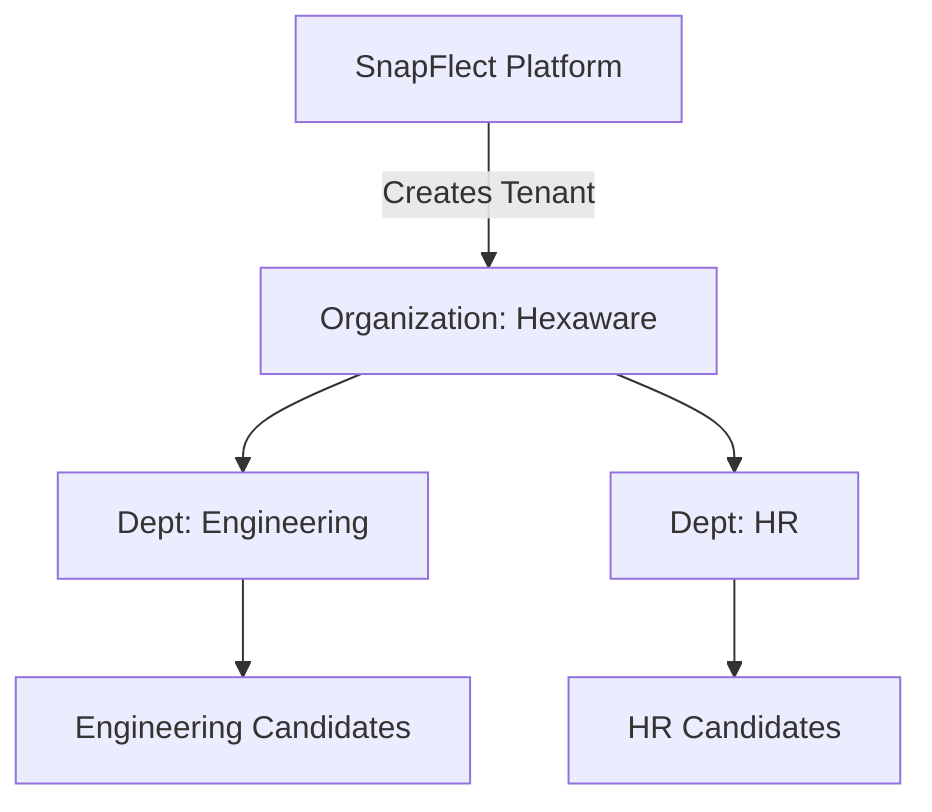

```mermaid
graph TD
    S[SnapFlect Platform] -->|Creates Partner Tenant| V[Organization: Virtusa]
    
    V --> BU1[Business Unit: Client A]
    V --> BU2[Business Unit: Client B]
    V --> BU3[Business Unit: Client C]
    
    BU1 --> C1[Client A Candidates]
    BU2 --> C2[Client B Candidates]
    
    style BU1 fill:#1e293b,stroke:#38bdf8
    style BU2 fill:#1e293b,stroke:#38bdf8
    style BU3 fill:#1e293b,stroke:#38bdf8
```

# SnapFlect Business Model & Tenancy Architecture

This document outlines how the SnapFlect Assessment Portal's hierarchical data structure and Role-Based Access Control (RBAC) natively support both Direct-to-Enterprise (B2B) and Partner/Reseller (B2B2B) business models.

## 1. Core Architectural Concepts

SnapFlect is built on a **Multi-Tenant SaaS Architecture**. This means a single instance of the software serves multiple distinct customer organizations, keeping their data strictly isolated from one another. 

To support complex corporate structures and agency relationships, the tenancy model is hierarchical:

1. **Platform (SnapFlect)**: The absolute root. Managed by Super Admins.
2. **Organizations (Tenants)**: The primary billing and isolation boundary (e.g., a direct client or a partner agency).
3. **Business Units**: High-level segments within an organization. *Crucial for the Partner Model to represent their downstream clients.*
4. **Departments / Locations**: Granular organizational segments.
5. **Roles & Permissions**: Fine-grained access control bound to specific scopes (e.g., a manager who can only see data within their specific Business Unit).

---

## 2. The Direct Client Model (Example: Hexaware)

In this model, an enterprise purchases SnapFlect to assess their own internal employees or direct hires.

### How it works:
1. **Provisioning**: SnapFlect creates a new Organization tenant named **Hexaware**.
2. **Tenant Isolation**: Hexaware's data (assessments, candidates, results, invoices) is securely walled off.
3. **Internal Hierarchy**: Hexaware administrators can mirror their corporate structure by creating Departments (e.g., `Engineering`, `Human Resources`) and Locations (e.g., `Chennai`, `London`).
4. **Self-Service**: Hexaware is assigned `Client Admin` roles, allowing them to manage their own users and assessments without SnapFlect's intervention.

### Visual Architecture

---

## 3. The Partner / Reseller Model (Example: Virtusa)

In this model, an agency or consultancy partners with SnapFlect to provide assessment services to *their* downstream clients.

### How it works:
1. **Provisioning**: SnapFlect creates an Organization tenant for **Virtusa**.
2. **Clients as Business Units**: Virtusa uses the "Business Units" tier to represent their individual clients. 
3. **Data Segmentation**: Using RBAC, Virtusa creates users (Assessment Managers) and restricts their scope strictly to a specific Business Unit.
   - *Example: John Doe is an Assessment Manager scoped ONLY to the "Client A" Business Unit. John cannot see Client B's data.*
4. **Partner Oversight**: Virtusa's top-level leadership is granted organizational-wide access, allowing them to view aggregated telemetry, analytics, and billing across all their downstream clients simultaneously.

### Visual Architecture

---

## 4. The Platform Administrator Advantage (Super Admin)

As the owner of the SnapFlect product, your internal team operates above all organizations.

### Global Capabilities:
- **Universal Visibility**: You have the ability to oversee Hexaware, Virtusa, and Virtusa's sub-clients from a centralized administrative dashboard.
- **Support & Troubleshooting**: Utilizing tools like the **Session Monitor** and **User Lookup**, your support engineers can drill down into any active session globally. 
  - *Scenario: A candidate taking an assessment for Virtusa's "Client B" experiences a network drop. SnapFlect support can look up the user, verify the live telemetry latency, and resolve the issue directly from the Support Portal.*
- **Global Feature Rollouts**: Because everyone is on the same multi-tenant codebase, when you deploy a new feature (like a new AI proctoring tool), it becomes immediately available to Hexaware, Virtusa, and all downstream clients simultaneously.

> [!TIP]
> **Scalability Note** 
> By utilizing Business Units for downstream clients rather than spinning up entirely new database instances for every single sub-client, you drastically reduce server overhead while maintaining strict logical data isolation through RBAC.
