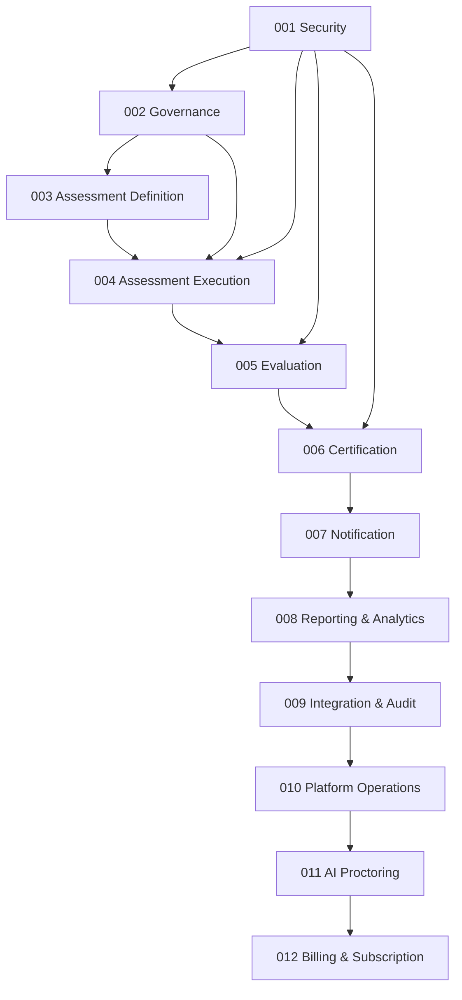

# SNAPFLECT ASSESSMENT PORTAL — PROJECT UNDERSTANDING REPORT

**Report Date:** 2026-06-20  
**Document Corpus:** 95 documents analyzed  
**PRD Master Version:** v1.2 FINAL  
**Architecture Status:** FROZEN / APPROVED  

---

## 1. DOCUMENT INVENTORY

### 1.1 Business Documents (16 documents)

| # | Document | Version | Status |
|---|----------|---------|--------|
| 1 | PRD – Part 1: Foundation, Vision, Architecture, Security & User Management | v1.0 | FINAL |
| 2 | PRD – Part 2: Assessment Definition Management | v1.0 | FINAL |
| 3 | PRD – Part 2 – Amendment: Assessment Assignment, Availability, Randomization | v1.1 | MERGED |
| 4 | PRD – Part 2 – Amendment: Question Usage Analysis Architecture Update | v1.2 | MERGED |
| 5 | PRD – Part 3: Assessment Execution, Attempts, Scoring & Review | v1.0 | FINAL |
| 6 | PRD – Part 3 – Amendment: Execution & Evaluation Enhancements | v1.1 | MERGED |
| 7 | PRD – Part 4: Dashboards, Reporting, Notifications, Audit & Governance | v1.0 | FINAL |
| 8 | PRD – Part 4 – Amendment: Dashboards, Reporting & Governance Enhancements | v1.1 | MERGED |
| 9 | PRD – Part 5: Database, API, UI/UX, Security, Performance & Roadmap | v1.0 | FINAL |
| 10 | PRD – Part 5 – Amendment: Architecture & Final Alignment | v1.1 | MERGED |
| 11 | PRD – Part 5 – Amendment: Database Normalization & ERD Alignment | v1.2 | MERGED (FINAL) |
| 12 | Schema Assumptions & Seed Data Strategy | v1.0 | FINAL |
| 13 | Full Platform Architecture Master Review | v1.0 | PASS |
| 14 | Screen Inventory and Navigation (015) | v1.0 | APPROVED/FROZEN |
| 15 | RBAC Matrix (016) | v1.0 | APPROVED/FROZEN |
| 16 | MVP Execution Package (022) | v1.0 | APPROVED |

---

### 1.2 Architecture Documents (4 documents)

| # | Document | Version | Status |
|---|----------|---------|--------|
| 1 | Platform Solution Architecture (013) | v1.0 | APPROVED/FROZEN |
| 2 | Platform API Architecture (014) | v1.0 | APPROVED/FROZEN |
| 3 | API Implementation Master Plan (018) | v1.0 | APPROVED/FROZEN |
| 4 | Cursor AI Development Playbook (021) | v1.0 | APPROVED/FROZEN |

---

### 1.3 Database Documents (38 documents)

| # | Schema | Design Doc | Parts | Amendment | ERD Parts | Data Dict Parts |
|---|--------|-----------|-------|-----------|-----------|-----------------|
| 001 | Security Schema | v1.0 | 3 | — | — | — |
| 002 | Governance Foundation Schema | v1.0 | 3 | — | — | — |
| 003 | Assessment Definition Schema | v1.0 | 4 | v1.1 | — | — |
| 004 | Assessment Execution Schema | v1.0 | 3 | v1.1, v1.2 | — | — |
| 005 | Evaluation Schema | v1.0 | 3 | v1.1 | — | — |
| 006 | Certification Schema | v1.0 | 2 | v1.1 | — | — |
| 007 | Notification Schema | v1.0 | 2 | v1.1 | — | — |
| 008 | Reporting & Analytics Schema | — | 2 | v1.1 | — | — |
| 009 | Integration & Audit Schema | — | 2 | v1.1 | — | — |
| 010 | Platform Operations Schema | — | 2 | v1.1 | — | — |
| 011 | AI Proctoring Schema | — | 2 | v1.1 | — | — |
| 012 | Billing & Subscription Schema | — | 2 | v1.1 | — | — |
| — | ERD | — | 4 | v1.1 | 4+1 | — |
| — | Data Dictionary | — | 4 | v1.1 | — | 4+1 |
| — | Database Standards | v1.0 | — | v1.1 | — | — |

**Total Database-Related Documents: 38** (12 Schema Designs + 30 Schema Part files + 5 ERD docs + 5 Data Dict docs + 2 DB Standards docs + some overlap with amendments)

---

### 1.4 API Documents (12 documents)

| # | Document | Version | Status |
|---|----------|---------|--------|
| 1 | OpenAPI Master Specification (017) | v1.0 | APPROVED/FROZEN |
| 2 | Security OpenAPI (017A) | v1.0 | APPROVED |
| 3 | Governance OpenAPI (017B) | v1.0 | APPROVED |
| 4 | Assessment Definition OpenAPI (017C) | v1.0 | APPROVED |
| 5 | Assessment Execution OpenAPI (017D) | v1.0 | APPROVED |
| 6 | Evaluation OpenAPI (017E) | v1.0 | APPROVED |
| 7 | Certification OpenAPI (017F) | v1.0 | APPROVED |
| 8 | Notification OpenAPI (017G) | v1.0 | APPROVED |
| 9 | Reporting & Analytics OpenAPI (017H) | v1.0 | APPROVED |
| 10 | Integration & Audit OpenAPI (017I) | v1.0 | APPROVED |
| 11 | Platform Operations OpenAPI (017J) | v1.0 | APPROVED |
| 12 | AI Proctoring OpenAPI (017K) | v1.0 | APPROVED |

> [!NOTE]
> **017L (Billing OpenAPI)** is referenced in the master specification (Doc 017) but **no file exists** in the Documents folder.

---

### 1.5 Development Governance Documents (3 documents)

| # | Document | Version | Status |
|---|----------|---------|--------|
| 1 | Laravel Folder Structure & Coding Standards (019) | v1.0 | APPROVED/FROZEN |
| 2 | Development Sprint Master Plan (020) | v1.0 | APPROVED/FROZEN |
| 3 | Cursor AI Development Playbook (021) | v1.0 | APPROVED/FROZEN |

---

## 2. ARCHITECTURE SUMMARY

### 2.1 Product Overview

**Snapflect Assessment Portal (SAP)** is an enterprise-grade, responsive web application for creating, managing, conducting, reviewing, and analyzing technology-based assessments. It supports the full assessment lifecycle from content creation to certification.

### 2.2 Technology Stack

| Layer | Technology |
|-------|-----------|
| **Backend** | PHP 8.4+, Laravel 12 LTS, REST APIs |
| **Frontend** | Angular 20 (changed from initial Blade/Bootstrap plan in Doc 018) |
| **Database** | MySQL 8+, InnoDB, utf8mb4_0900_ai_ci |
| **Authentication** | JWT (Laravel Sanctum optional) |
| **Hosting Phase 1** | Hostinger Shared Hosting |
| **Hosting Future** | VPS → Azure / AWS / Docker |
| **API Standard** | OpenAPI 3.1, Swagger |
| **Queue** | Database Queue Driver |

### 2.3 Architecture Style

- **Modular Monolith** — explicitly approved; microservices rejected
- **Layered Architecture**: Presentation → Controller → Service → Repository → MySQL
- **SOLID Principles** enforced throughout
- **Repository Pattern** mandatory for all data access
- **DTO Pattern** mandatory between layers (no raw arrays)

### 2.4 Domain Hierarchy (Immutable Rule)

```
Technology → Assessment → Section → Question Bank → Question
```

This hierarchy must **never** be violated. All modules are designed around it.

### 2.5 Key Architectural Decisions

| Decision | Outcome |
|----------|---------|
| Snapshot Architecture | **Hybrid** — runtime tables for reporting, JSON snapshots for audit |
| Question Usage Analysis | **Derived service** — physical table `question_usage_analysis` removed |
| Answer Normalization | MCQ answers stored in `question_options.is_correct`; non-MCQ answers in `question_answers` |
| Notification Architecture | **Hybrid** — template versioning with subject/message snapshots |
| Reporting | **Derived analytics** preferred over persisted analytics |
| File Storage | **Metadata in DB, files on filesystem** (future Azure Blob/S3 compatible) |
| Soft Deletes | **Mandatory** on all business entities; physical deletes prohibited |
| MySQL ENUM | **Prohibited** — use `VARCHAR(50)` instead |

---

## 3. MODULE INVENTORY

The platform consists of **12 core modules**:

| # | Module | Schema | Description | Sprint |
|---|--------|--------|-------------|--------|
| 01 | **Security** | 001 | Users, Roles, Permissions, Authentication, RBAC, Sessions | Sprint 01 |
| 02 | **Governance Foundation** | 002 | File management, Attachments, Configuration, Audit logs, Activity logs | Sprint 01 |
| 03 | **Assessment Definition** | 003 | Technologies, Assessments, Sections, Question Banks, Questions, Options, Answers, Versioning | Sprint 02–03 |
| 04 | **Assessment Execution** | 004 | Assignments, Attempts, Timers, Responses, Draft Saves, Snapshots | Sprint 04–05 |
| 05 | **Evaluation** | 005 | Evaluation rules, Auto/Manual scoring, Review workflow, Result publication | Sprint 06 |
| 06 | **Certification** | 006 | Certificate templates, Issuance, Verification (QR/URL), Revocation, Digital signatures | Sprint 07 |
| 07 | **Notification** | 007 | Templates, Multi-channel (Email/SMS/Push/In-App), Queue, Delivery tracking, Preferences | Sprint 08 |
| 08 | **Reporting & Analytics** | 008 | Report definitions, Dashboards, KPIs, Analytics snapshots | Sprint 09 |
| 09 | **Integration & Audit** | 009 | API clients, Webhooks, Audit events, Data imports/exports | Sprint 10 |
| 10 | **Platform Operations** | 010 | System settings, Feature flags, Background jobs, Scheduler, Health monitoring, Announcements | Sprint 11 |
| 11 | **AI Proctoring** | 011 | Proctoring sessions, Events, Violations, AI detection, Evidence, Reviews | Sprint 12–13 |
| 12 | **Billing & Subscription** | 012 | Subscription plans, Customer subscriptions, Usage metering, Invoices, Payments | Sprint 14–15 |

---

## 4. RBAC MODEL

### 4.1 Roles (10 defined)

| Code | Role | Scope |
|------|------|-------|
| R01 | Platform Administrator | Global — ALL permissions |
| R02 | Organization Administrator | Organization-scoped |
| R03 | Assessment Manager | Assessment lifecycle management |
| R04 | Question Author | Question creation |
| R05 | Question Reviewer | Question approval |
| R06 | Evaluator | Manual evaluation |
| R07 | Candidate | Assessment participation (own data only) |
| R08 | Billing Administrator | Commercial operations |
| R09 | Support Administrator | Support operations |
| R10 | Auditor | Read-only audit & compliance |

### 4.2 Permission Model

- **Format:** `Module.Action` (e.g., `Assessment.Create`, `Question.Approve`)
- **Estimated:** 150–250 permissions, 1000+ role-permission mappings
- **Separation of duties enforced** (e.g., Question Author cannot approve own questions)
- **Implementation:** `spatie/laravel-permission` recommended

### 4.3 Authorization Flow

```
User → Role → Permission → Screen Access → API Access → Business Action
```

---

## 5. MULTI-TENANCY MODEL

- **Organization-scoped** data isolation via `organization_id` on business tables
- **Organization Administrator** can access only their own organization
- **Platform Administrator** has global access across all organizations
- **Tenant-filter enforcement** layer recommended at API level
- **Billing** separated per tenant via `customer_subscriptions`

> [!IMPORTANT]
> The PRD v1.0 initially listed Multi-Tenancy as **out of scope for V1**, but the architecture evolved through amendments (especially the Architecture documents 013–016 and Schema 012) to include multi-tenancy as a foundational capability. The initial V1 PRD defined only 3 roles (Super Admin, Assessment Admin, User), but the architecture expanded this to 10 roles.

---

## 6. DATABASE SCHEMA INVENTORY

### 6.1 Master Data Tables

| # | Table | Schema |
|---|-------|--------|
| 1 | `users` | 001 |
| 2 | `user_profiles` | 001 |
| 3 | `roles` | 001 |
| 4 | `permissions` | 001 |
| 5 | `user_roles` | 001 |
| 6 | `role_permissions` | 001 |
| 7 | `user_sessions` | 001 |
| 8 | `password_resets` | 001 |
| 9 | `email_verifications` | 001 |
| 10 | `technologies` | 003 |
| 11 | `technology_versions` | 003 |
| 12 | `assessments` | 003 |
| 13 | `assessment_versions` | 003 |
| 14 | `sections` | 003 |
| 15 | `section_versions` | 003 |
| 16 | `question_banks` | 003 |
| 17 | `question_bank_versions` | 003 |
| 18 | `section_question_banks` | 003 |
| 19 | `questions` | 003 |
| 20 | `question_versions` | 003 |
| 21 | `question_options` | 003 |
| 22 | `question_answers` | 003 |
| 23 | `content_approvals` | 003 |
| 24 | `assessment_assignments` | 003/PRD Amendment |
| 25 | `assessment_publish_validations` | 003/PRD Amendment |

### 6.2 Runtime / Execution Tables

| # | Table | Schema |
|---|-------|--------|
| 26 | `assessment_attempts` | 004 |
| 27 | `attempt_timers` | 004 |
| 28 | `assessment_attempt_sections` | 004 |
| 29 | `assessment_attempt_question_banks` | 004 |
| 30 | `assessment_attempt_questions` | 004 |
| 31 | `question_responses` | 004 |
| 32 | `draft_saves` | 004 |
| 33 | `attempt_snapshots` | 004 |

### 6.3 Evaluation Tables

| # | Table | Schema |
|---|-------|--------|
| 34 | `evaluation_rules` | 005 |
| 35 | `evaluation_rule_versions` | 005 |
| 36 | `evaluation_jobs` | 005 |
| 37 | `evaluation_results` | 005 |
| 38 | `manual_review_queue` | 005 |
| 39 | `review_assignments` | 005 |
| 40 | `result_publications` | 005 |

### 6.4 Certification Tables

| # | Table | Schema |
|---|-------|--------|
| 41 | `certificate_templates` | 006 |
| 42 | `certificates` | 006 |
| 43 | `certificate_issuances` | 006 |
| 44 | `certificate_verifications` | 006 |
| 45 | `certificate_revocations` | 006 |
| 46 | `certificate_signatures` | 006 |

### 6.5 Notification Tables

| # | Table | Schema |
|---|-------|--------|
| 47 | `notification_templates` | 007 |
| 48 | `notification_template_versions` | 007 |
| 49 | `notification_channels` | 007 |
| 50 | `notification_queue` | 007 |
| 51 | `notification_delivery_logs` | 007 |
| 52 | `notification_preferences` | 007 |
| 53 | `notification_subscriptions` | 007 |

### 6.6 Governance & Platform Tables

| # | Table | Schema |
|---|-------|--------|
| 54 | `file_uploads` | 002 |
| 55 | `attachments` | 002 |
| 56 | `system_settings` | 002/010 |
| 57 | `audit_logs` | 002 |
| 58 | `activity_logs` | 002 |
| 59 | `feature_flags` | 010 |
| 60 | `background_jobs` | 010 |
| 61 | `job_executions` | 010 |
| 62 | `scheduled_tasks` | 010 |
| 63 | `application_health` | 010 |
| 64 | `system_announcements` | 010 |

### 6.7 Reporting & Analytics Tables

| # | Table | Schema |
|---|-------|--------|
| 65 | `report_definitions` | 008 |
| 66 | `report_versions` | 008 |
| 67 | `report_executions` | 008 |
| 68 | `report_exports` | 008 |
| 69 | `dashboard_definitions` | 008 |
| 70 | `dashboard_versions` | 008 |
| 71 | `dashboard_widgets` | 008 |
| 72 | `analytics_snapshots` | 008 |
| 73 | `kpi_definitions` | 008 |
| 74 | `kpi_snapshots` | 008 |

### 6.8 Integration & Audit Tables

| # | Table | Schema |
|---|-------|--------|
| 75 | `api_clients` | 009 |
| 76 | `api_keys` | 009 |
| 77 | `webhooks` | 009 |
| 78 | `webhook_deliveries` | 009 |
| 79 | `integration_events` | 009 |
| 80 | `audit_events` | 009 |
| 81 | `data_exports` | 009 |
| 82 | `data_imports` | 009 |

### 6.9 AI Proctoring Tables

| # | Table | Schema |
|---|-------|--------|
| 83 | `proctoring_sessions` | 011 |
| 84 | `proctoring_events` | 011 |
| 85 | `proctoring_violations` | 011 |
| 86 | `ai_detection_results` | 011 |
| 87 | `media_evidence` | 011 |
| 88 | `proctoring_reviews` | 011 |

### 6.10 Billing & Subscription Tables

| # | Table | Schema |
|---|-------|--------|
| 89 | `subscription_plans` | 012 |
| 90 | `customer_subscriptions` | 012 |
| 91 | `subscription_usage` | 012 |
| 92 | `invoices` | 012 |
| 93 | `invoice_items` | 012 |
| 94 | `payments` | 012 |
| 95 | `payment_transactions` | 012 |

### 6.11 PRD Amendment Tables (not in schema but referenced)

| # | Table | Source |
|---|-------|--------|
| 96 | `review_acknowledgements` | PRD Part 3 Amendment |
| 97 | `assignment_activity_logs` | PRD Part 3 Amendment |
| 98 | `randomization_audit_logs` | PRD Part 3 Amendment |

> **Total Identified Tables: ~98** (excluding derived/removed entities)

### 6.12 Removed Entities

| Entity | Reason |
|--------|--------|
| `question_usage_analysis` | Replaced by derived analytics service (PRD Part 2 Amendment v1.2) |

---

## 7. OPENAPI INVENTORY

| # | Specification | Coverage | Status |
|---|--------------|----------|--------|
| 017 | Master Specification | Standards, governance, response contracts | APPROVED |
| 017A | Security OpenAPI | Auth, Users, Roles, Permissions | APPROVED |
| 017B | Governance OpenAPI | Settings, Templates, Workflows | APPROVED |
| 017C | Assessment Definition OpenAPI | Technologies, Assessments, Sections, QB, Questions | APPROVED |
| 017D | Assessment Execution OpenAPI | Assignments, Attempts, Answers, Snapshots | APPROVED |
| 017E | Evaluation OpenAPI | Evaluations, Results | APPROVED |
| 017F | Certification OpenAPI | Certificates, Verification, Revocation | APPROVED |
| 017G | Notification OpenAPI | Notifications, Templates, Subscriptions | APPROVED |
| 017H | Reporting & Analytics OpenAPI | Reports, Dashboards, KPIs | APPROVED |
| 017I | Integration & Audit OpenAPI | Audit, Imports, Exports, Integration Events | APPROVED |
| 017J | Platform Operations OpenAPI | Tasks, Health, Announcements | APPROVED |
| 017K | AI Proctoring OpenAPI | Sessions, Violations, Evidence, Reviews | APPROVED |

> [!WARNING]
> **017L — Billing & Subscription OpenAPI** is referenced in the Master Specification (Doc 017, Section 26) but **no corresponding document file exists** in the Documents folder.

---

## 8. SPRINT INVENTORY

### 8.1 Sprint Plan (16 Sprints × 2 weeks each = 32 weeks)

| Sprint | Name | Modules | Dependencies | Release |
|--------|------|---------|-------------|---------|
| 01 | Platform Foundation | Security, Governance | None | — |
| 02 | Question Bank | Question Bank, Categories, Metadata | Sprint 01 | — |
| 03 | Assessment Builder | Sections, Assessments, Templates | Sprint 02 | — |
| 04 | Assessment Assignment | Assignments, Candidate Allocation | Sprint 03 | — |
| 05 | Assessment Execution | Attempts, Answers, Timers | Sprint 04 | — |
| 06 | Evaluation Engine | Scoring, Evaluation, Results | Sprint 05 | **Release 1 (MVP)** |
| 07 | Certification | Certificates, QR Verification | Sprint 06 | — |
| 08 | Notification Platform | Email, SMS, In-App | Sprint 07 | **Release 2** |
| 09 | Analytics | Dashboards, KPIs, Reports | Sprint 08 | — |
| 10 | Integrations | Imports, Exports, Webhooks, Audit | Sprint 09 | **Release 3** |
| 11 | Platform Operations | Schedulers, Health, Monitoring | Sprint 10 | — |
| 12 | AI Proctoring Foundation | Sessions, Evidence Capture | Sprint 11 | — |
| 13 | AI Review Workbench | Detections, Reviews, Violations | Sprint 12 | **Release 4** |
| 14 | Billing Foundation | Plans, Subscriptions | Sprint 13 | — |
| 15 | Billing Completion | Invoices, Payments | Sprint 14 | **Release 5** |
| 16 | Platform Hardening | Security/Perf Review, Refactoring | All | — |

### 8.2 Release Plan

| Release | Target | Scope |
|---------|--------|-------|
| **R1 (MVP)** | End Sprint 06 | Security → Evaluation |
| **R2** | End Sprint 08 | + Certification, Notifications |
| **R3** | End Sprint 10 | + Analytics, Integrations |
| **R4** | End Sprint 13 | + Operations, AI Proctoring |
| **R5 (Commercial)** | End Sprint 15 | + Billing, Payments |

---

## 9. IDENTIFIED DEPENDENCIES

### 9.1 Module Dependency Chain



### 9.2 Cross-Cutting Dependencies

- **Security (001)** — required by ALL modules
- **Governance (002)** — audit_logs, activity_logs, attachments, system_settings used by ALL modules
- **Snapshot Architecture** — cross-cuts Assessment Definition (003), Execution (004), and Evaluation (005)
- **RBAC** — every screen and API endpoint is permission-gated

---

## 10. MISSING INFORMATION

| # | Area | Description | Severity |
|---|------|-------------|----------|
| 1 | **Billing OpenAPI (017L)** | Referenced in Doc 017 Section 26 but file is missing from Documents folder | **HIGH** |
| 2 | **Organization/Department/Business Unit/Location Tables** | The MVP Execution Package (022) details migrations for `organizations`, `departments`, `business_units`, `locations` — but these tables do not appear in Schema 002 (Governance Foundation) which covers file_uploads, attachments, system_settings, audit_logs, activity_logs. Schema 002 Design does not include organization hierarchy tables. | **HIGH** |
| 3 | **Frontend Technology Discrepancy** | PRD Part 1 specifies Bootstrap 5 + JavaScript + AJAX. Doc 018 and 020 specify Angular 20. Doc 013 mentions Laravel Blade + Bootstrap. No formal amendment reconciles this conflict. | **MEDIUM** |
| 4 | **Encryption Policy** | Architecture Master Review (Finding SEC-02) recommends a platform-wide encryption policy document. Not yet created. | **LOW** |
| 5 | **Data Classification Matrix** | Architecture Master Review (Finding SEC-01) recommends a Data Classification Matrix for PII, Financial Data, Evidence, Certificates. Not yet created. | **LOW** |
| 6 | **Sprint 01 Story Backlog** | Doc 022 provides MVP execution but no formal story-level backlog exists for Sprint 01 | **LOW** |
| 7 | **023 Sprint 01 Implementation Review Framework** | Referenced in Doc 022 as a next document but does not exist | **LOW** |
| 8 | **Content Library Schema (013+)** | Mentioned as optional future schema but architecture review declared it not required | **INFO** |

---

## 11. IDENTIFIED RISKS

### 11.1 Technical Risks

| # | Risk | Severity | Mitigation |
|---|------|----------|-----------|
| R1 | **Hostinger Shared Hosting Limitations** — Platform designed for 100K+ users but initial deployment is shared hosting with CPU/memory/IO constraints | **HIGH** | Architecture designed for migration path (VPS → Cloud). Must validate shared hosting performance early with realistic load. |
| R2 | **Snapshot Storage Growth** — `attempt_snapshots` storing LONGTEXT JSON will grow rapidly with assessment volume | **MEDIUM** | Architecture Master Review recommends partitioning for tables exceeding 10M+ rows. Archive strategy needed. |
| R3 | **Frontend Technology Decision Not Frozen** — PRD says Bootstrap/Blade, Doc 018/020 say Angular 20, Doc 013 says Blade+Bootstrap. No formal resolution. | **MEDIUM** | Requires explicit architectural decision and PRD amendment before Sprint 01 frontend work begins. |
| R4 | **No Payment Gateway Integration Specified** — Billing Schema (012) covers subscription/invoice/payment tables but no specific payment gateway integration is documented | **MEDIUM** | Needs provider selection (Stripe, Razorpay, etc.) before Sprint 14. |
| R5 | **Organization Schema Gap** — MVP Execution Package references organization tables not defined in any schema design document | **MEDIUM** | Need to formalize organization hierarchy schema (organizations, departments, business_units, locations) either as a new schema or an amendment to Schema 002. |
| R6 | **Test Coverage Target vs. Reality** — 80%+ coverage target with AI-generated code across 12 modules and 120+ screens is ambitious | **MEDIUM** | Prioritize critical path testing (assessment execution, scoring, snapshot integrity) over blanket coverage. |
| R7 | **No CI/CD Pipeline Documented** — Deployment strategy mentions environments (Dev, QA, Staging, Prod) but no CI/CD pipeline is specified | **LOW** | Acceptable for initial Hostinger deployment but must be addressed before multi-environment strategy. |

### 11.2 Process Risks

| # | Risk | Severity | Mitigation |
|---|------|----------|-----------|
| R8 | **Document Volume vs. Consistency** — 95 documents with multiple amendments create risk of conflicting information | **MEDIUM** | Document hierarchy is defined (PRD → ERD → Schemas → Architecture → OpenAPI → Implementation → Coding Standards → Playbook). Lower documents cannot override higher. |
| R9 | **Cursor AI Governance Dependency** — Heavy reliance on AI code generation with ChatGPT review creates single-point-of-failure for architecture compliance | **LOW** | Document 021 establishes comprehensive review workflow. Developer oversight required for final approval. |

---

## 12. KEY DESIGN PATTERNS & STANDARDS

| Pattern | Standard |
|---------|----------|
| **Primary Keys** | `id BIGINT UNSIGNED AUTO_INCREMENT` (never exposed externally) |
| **Public Identifiers** | `uuid CHAR(36) NOT NULL UNIQUE` on all business entities |
| **Audit Fields** | `created_by`, `created_date`, `modified_by`, `modified_date` on all mutable entities |
| **Soft Delete** | `is_active`, `is_deleted`, `deleted_by`, `deleted_date` — physical deletes prohibited |
| **Versioning** | `version_number`, `parent_entity_id`, `is_current_version` — published versions immutable |
| **Date/Time** | `DATETIME` in UTC |
| **Booleans** | `TINYINT(1)` — BIT prohibited |
| **Enums** | `VARCHAR(50)` — MySQL ENUM prohibited |
| **JSON** | `JSON` for queryable data, `LONGTEXT` for immutable snapshots |
| **Cascading** | `RESTRICT` by default — `ON DELETE CASCADE` prohibited for business entities |
| **Controller Max** | 300 lines |
| **Service Max** | 1000 lines (must split if larger) |
| **Test Coverage** | 80%+ minimum |
| **API Rate Limit** | 60 req/min (default), 120 req/min (authenticated) |

---

## 13. DOCUMENT HIERARCHY (CONFLICT RESOLUTION)

When documents conflict, the following priority order governs:

1. **PRD** (Master authority)
2. **ERD**
3. **Database Schemas (001–012)**
4. **Platform Architecture (013)**
5. **API Architecture (014)**
6. **RBAC Matrix (016)**
7. **OpenAPI Specifications (017A–017K)**
8. **Implementation Plan (018)**
9. **Coding Standards (019)**
10. **Cursor Playbook (021)**

Lower documents **cannot** override higher documents.

---

## 14. ARCHITECTURE SCORECARD (from Master Review)

| Area | Score |
|------|-------|
| Domain Coverage | 98/100 |
| Security | 95/100 |
| Multi-Tenancy | 95/100 |
| Scalability | 96/100 |
| Auditability | 99/100 |
| Billing | 98/100 |
| Assessment Lifecycle | 100/100 |
| Production Readiness | 97/100 |

**Verdict:** PASS — No critical gaps. Architecture FROZEN and APPROVED for development.

---

## 15. SUMMARY

The Snapflect Assessment Portal has an exceptionally thorough documentation foundation — 95 documents spanning PRD, ERD, 12 database schemas, 11 OpenAPI specifications, architecture blueprints, RBAC matrix, coding standards, sprint plans, and development playbooks. The architecture is frozen at v1.2 and approved for development.

**Key attention areas before Sprint 01 execution:**
1. Resolve the **frontend technology discrepancy** (Bootstrap/Blade vs Angular 20)
2. Formalize the **organization hierarchy schema** (referenced in MVP but missing from schema designs)
3. Create or locate the **Billing OpenAPI (017L)** specification
4. Validate **Hostinger shared hosting** capacity against the application's resource demands

**Awaiting your approval to proceed.**
